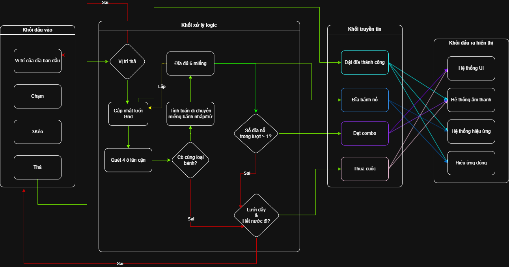

# Cheezy Savoround (Bloom Sort 3D - Phiên bản Pizza)

## Giới thiệu

Cheezy Savoround là một tựa game giải đố thể loại **Casual game** thuộc nhánh **Puzzle/Sort (Giải đố/Sắp xếp - Hợp nhất)** với thao tác đơn giản **chạm, kéo, thả** các đĩa _Pizza_ từ khay đĩa vào lưới trên bàn.

## Luồng chạy chính

> 1. **Tương tác**: Người chơi kéo thả đĩa Pizza từ khay đĩa vào lưới.
> 2. **Hợp nhất và phát nổ**: Khi các đĩa Pizza được đặt cạnh nhau (ở 4 hướng lân cận _Trên, Dưới, Trái, Phải_), các miếng Pizza cùng loại sẽ bay tự do để tự gom lại với nhau. Khi 1 đĩa gom đủ 6 miếng cùng loại, nó sẽ phát _"nổ"_ rồi biến mất, _giải phóng_ ô trống đó, đồng thời **kích hoạt chuỗi kiểm tra** hợp nhất cho các đĩa xung quanh tạo thành chuỗi **Combo**.
> 3. **Thua cuộc**: Trò chơi kết thúc khi cả lưới trên bàn và khay đĩa đều bị lấp đầy, đồng thời không còn lượt di chuyển hay hợp nhất hợp lệ nào được thực hiện.

## Sơ đồ hoạt động hệ thống

